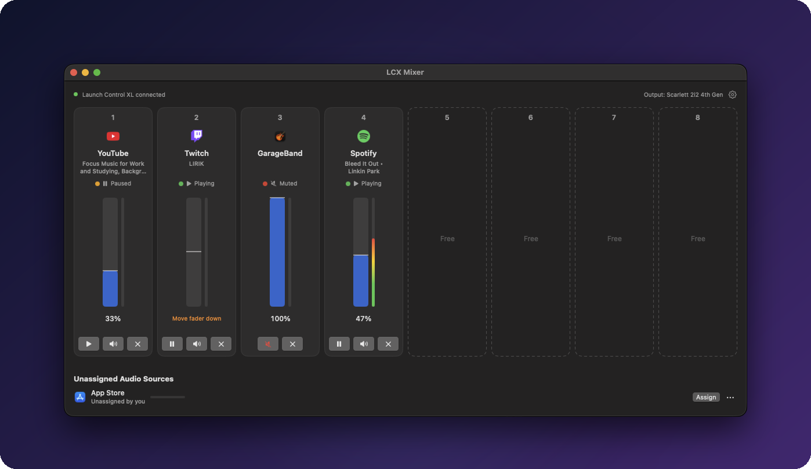
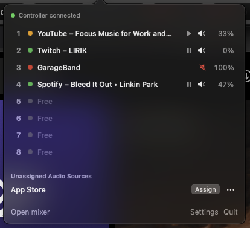
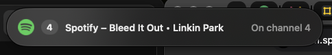

<h1 align="center">LCX Mixer</h1>

<p align="center"><strong>A hardware mixer for everything playing on your Mac.</strong></p>

<p align="center">
  
</p>

LCX Mixer turns a Novation Launch Control XL mk2 into an 8-channel mixer for whatever is making sound: individual Chrome tabs (Spotify, YouTube, Twitch…) and native apps (games, Discord, Music…). Each new source lands on the next free fader automatically.

## Why it exists

macOS has no per-app volume mixer, and browsers play every tab through one shared audio stream. In practice that means balancing a game, a voice chat and music by hunting through tabs and in-app sliders, often mid-game.

A physical controller solves that: one fader per source, always in the same place, usable without looking or switching windows. LCX Mixer makes that work for both native apps and individual browser tabs, with no setup per session.

https://github.com/user-attachments/assets/81d2e758-2983-4775-951c-c71e33042e1c

**What you get**

- **Automatic assignment:** a new source takes the next free channel, first come, first served, and keeps it until it closes.
- **Per-tab control:** Spotify, YouTube and Twitch in the same browser each get their own fader.
- **Hands-free control:** volume on the faders, play/pause and mute on the buttons, and mute-all on the side Mute button.
- **Clear feedback:** controller LEDs, a mixer window, a menu-bar panel and a short on-screen pop-up all show the same state.
- **Fully local:** no account, no server, no network connections (see *Security*).

The full product specification, including assignment rules, LED colours and edge cases, is in [docs/SPEC.md](docs/SPEC.md).

## Requirements

- macOS 14.2 or later (Apple silicon)
- Novation Launch Control XL **mk2** (the app switches it to Factory Template 1 automatically)
- Google Chrome, for per-tab control
- Xcode (free from the App Store), to build

## Build and install

1. Clone or download this repository.
2. Double-click **Build LCX Mixer.command**, or run `./scripts/build.sh`.
   The script builds the app, signs it, installs it to Applications and launches it.
   If you have an "Apple Development" certificate (Xcode → Settings → Accounts → Manage Certificates), the app keeps its audio permission between rebuilds.
3. On first use, macOS asks for **System audio recording**. It's needed to control the volume of native apps.

## Chrome extension

The app keeps an up-to-date copy of the extension at:

```
~/Library/Application Support/LCXMixer/ChromeExtension
```

In Chrome, open `chrome://extensions`, turn on **Developer mode**, choose **Load unpacked** and select that folder. Load it from that folder rather than from this repository: that copy updates itself whenever the app is rebuilt.

## Controls

| Control | Action |
| --- | --- |
| Fader | Volume. If the fader is below the current level it takes over immediately; if it's above, move it down to take over. |
| Top button row | Play / pause (Chrome tabs). Double-press on a Twitch channel jumps to live. |
| Bottom button row | Mute. Hold for 1 second to unassign the channel. |
| Side **Mute** button | Mute all / unmute all |
| Bottom knob row | Playback speed: centre = 1×, left end 0.5×, right end 2× (LED green when faster, red when slower) |
| Middle knob row | Seek shuttle: turn right to skip forward, left to skip back; the further you turn, the bigger the jumps (5 / 15 / 30 s). Centre stops. |

**LED colours:** green = playing, amber = paused, red = muted, off = empty channel.

## On screen

The **mixer window** (shown at the top) lays the 8 channels out in the same order as the controller's columns. Sources that are playing without a channel wait in **Unassigned Audio Sources** below, where you can assign them or drag them onto a channel.

The **menu-bar panel** shows the same channels as compact rows, one click away:



Touching any control shows a short **pop-up** on the screen where that source is playing, so you can mix without opening anything:



## Security

LCX Mixer has **no network attack surface**: there is no server or web app, and nothing listens on the network.

- Chrome talks to the app only through Chrome's native messaging, which Chrome allows only for this extension's ID.
- The app and its Chrome bridge connect through a local socket that only your user account can access. Each side checks that the other runs under your account and carries the app's own code signature.
- Site icons come from Chrome's local icon cache. The app makes no network requests.
- The only permission requested is System audio recording.

## Known limitations

- **Chrome tab meters** show an activity pulse, not real levels. macOS can't separate the sound of individual tabs.
- **Twitch live streams:** "pause" silences the tab and keeps the stream live. A background tab can't reliably resume a paused live stream.
- **Spotify** applies its own loudness curve to its volume slider, so the bottom half of the fader is gentler than on other sources.
- To check the audio permission and to identify which app a background audio process belongs to, the app uses two undocumented macOS functions. Future macOS versions could change them.

## How it was made

LCX Mixer was designed and specified by @Blazenkoo (on Github.com) and built with Claude (Anthropic), from an approved specification through hardware testing on a real controller.

## License

MIT, see [LICENSE](LICENSE).
