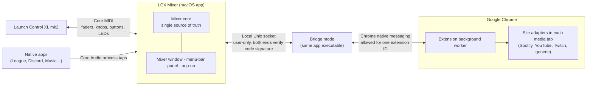

# LCX Mixer — Specification v1.0 (as built)

This is the product specification LCX Mixer was built from, updated to match what shipped in v1.0. For build and install steps, see the [README](../README.md).

## Contents

- [Overview and goals](#overview-and-goals)
- [Architecture](#architecture)
- [Sources, grouping and channel assignment](#sources-grouping-and-channel-assignment)
- [Unassigned sources and the ignore list](#unassigned-sources-and-the-ignore-list)
- [Control mapping](#control-mapping)
- [Knobs](#knobs)
- [Mixer window](#mixer-window)
- [Menu-bar icon, panel and on-screen pop-up](#menu-bar-icon-panel-and-on-screen-pop-up)
- [Per-source behaviour](#per-source-behaviour)
- [Status colours](#status-colours)
- [Settings and what is remembered](#settings-and-what-is-remembered)
- [Edge cases and failure handling](#edge-cases-and-failure-handling)
- [Permissions, install and build](#permissions-install-and-build)
- [Security](#security)
- [Licence and distribution](#licence-and-distribution)
- [Later ideas, outside v1](#later-ideas-outside-v1)

## Overview and goals

A small macOS menu-bar app, paired with a Chrome extension, turns the Launch Control XL mk2 into an 8-channel mixer for everything playing on the Mac. Native apps such as League of Legends or Discord, and individual Chrome tabs such as Spotify Web, YouTube and Twitch, each land on a fader automatically, first come, first served.

**Goals for v1**

- Every audible source on the Mac can be put on a channel: native apps and individual Chrome tabs alike.
- Assignment is automatic and stable: a source keeps its channel until it closes or you unassign it.
- The mixer window, the menu-bar panel and the controller LEDs always show the same state.
- No volume jumps from the non-motorised faders.
- Works properly from the first run: clear permission prompts, clear errors, no silent failures.

**Non-goals for v1**

- Browsers other than Chrome (Safari or Firefox tabs would only appear as one whole app).
- Controllers other than the Launch Control XL mk2.
- Prebuilt or notarised downloads. It's shared as source code that people build themselves.

## Architecture

The Mac app is the hub: it owns the controller, the native-app audio and all state. The Chrome extension is its hands inside Chrome.

The controller and native apps connect straight to the Mac app; Chrome tabs are reached only through the extension.

**Mac app (Swift, SwiftUI)**

1. **Controller service.** Talks to the Launch Control XL over Core MIDI: reads faders, knobs and buttons, writes LEDs, and reconnects on its own when replugged.
2. **Audio engine.** Finds which apps are producing sound, traces helper processes back to the app you'd recognise, and applies grouping. For each assigned native source it uses a macOS process tap (macOS 14.2+) to take over that app's audio and play it back at the channel's volume, mute state and master gain. It also measures each source's level for the meters.
3. **Mixer core.** The single source of truth: channels, the unassigned list, soft takeover, master mode, settings. Every UI surface and the LEDs read from it.
4. **UI.** The mixer window, the menu-bar icon and panel, and the on-screen pop-up.
5. **Chrome bridge.** The same app executable, which Chrome launches in a small bridge mode through native messaging. It relays messages between the extension and the main app over a local socket.

**Chrome extension (Manifest V3)**

1. **Background worker.** Reports every audible tab to the Mac app (title, site, icon from Chrome's local cache, play state, speed, window position), applies tab mute, routes the app's commands to the right tab, and updates itself whenever the app is rebuilt.
2. **Site adapters.** Small scripts in each media tab that set volume, play/pause, speed and seek position through the site's own player.

**One rule ties them together:** Chrome itself is never treated as a native source. Its audio is handled tab by tab through the extension, so Chrome and its tabs never fight over the same sound.

## Sources, grouping and channel assignment

A source is either one native app (or app group) or one Chrome tab. A new source takes the lowest free channel and keeps it until it closes or you unassign it.

**What counts as a source**

- **Native app:** any app other than Chrome that starts producing sound. Sound from hidden helper processes is credited to the app that owns them.
- **App group:** several apps shown and controlled as one source. Built-in group: **League** = Riot Client + League client + League game. Groups are editable in Settings.
- **Chrome tab:** each audible tab is its own source, named after the site (Spotify, YouTube, Twitch) with the page title as detail.

**Assignment rules**

1. **New source:** the moment it first makes sound, it takes the lowest free channel. If master mode is on, channel 1 is never used for sources.
2. **Held until closed:** pausing, silence, or an idle app never frees a channel. Only quitting the app, closing the tab, or unassigning it does.
3. **Same tab, new site:** a tab that navigates elsewhere keeps its channel; the slot updates its icon and name.
4. **All channels full:** the new source goes to the unassigned list (see next section) and waits.
5. **A channel frees:** the source that has waited longest in the unassigned list takes it. Sources you unassigned yourself don't count as waiting.
6. **No reshuffling:** channels are never reordered or compacted automatically. Drag-and-drop is the only way to move a source to a different channel.

## Unassigned sources and the ignore list

Sources that are playing but not on a channel appear in an **Unassigned Audio Sources** list below the channels, in both the window and the menu-bar panel.

| How a source gets there | Gets a channel again… |
| --- | --- |
| All channels were full when it started | Automatically, when a channel frees (longest-waiting first) |
| You unassigned it (UI button, or hold its mute button for 1 s) | Only when you click **Assign** or drag it onto a channel |

- **Assign** places the source on the first free channel. With no free channel, the button is disabled and says so.
- **Drag a source onto a channel** to place it there. If that channel is occupied, the two swap: the previous occupant moves to Unassigned as "unassigned by you."
- **Unassigning a channel** frees it at once. The audio carries on at its current volume.
- **Manual unassigning lasts until the source closes.** If League is unassigned and then reopened later, it's a new source and takes a channel normally.
- **Ignore list (permanent, in Settings):** apps or websites that never take a channel and never show in Unassigned, such as system sounds, notification chimes or FaceTime. Any source in Unassigned can be added via its "Always ignore" menu.

## Control mapping

Each of the 8 columns is one channel. The controller stays on **Factory Template 1** (MIDI channel 9); the app selects it automatically. Control numbers and LED values follow Novation's Launch Control XL mk2 programmer's reference.

| Control | Action | Notes |
| --- | --- | --- |
| Fader (per channel) | Volume, 0–100% | Soft takeover; volume curve so the lower half is usable |
| Top button row, Track Focus (per channel) | Play / pause | Chrome tabs only; does nothing on native apps (LED off). Double-press on Twitch jumps to live |
| Bottom button row, Track Control (per channel) | Mute / unmute | Works on every source. **Hold 1 s = unassign the channel** |
| Side button **Mute** | Mute all / unmute all | Restores each channel's own mute state afterwards |
| Bottom knob row (Pan/Device) | Playback speed | See [Knobs](#knobs) |
| Middle knob row (Send B) | Seek shuttle | See [Knobs](#knobs) |
| Top knob row, other side buttons, arrows | Unassigned in v1 | |

**Master mode (toggle in Settings, off by default)**

- When on, fader 1 controls macOS's output volume and sources use channels 2–8. Channel 1's LEDs stay off and its slot shows a distinct "Master" style.
- Only available when the current output device lets macOS control its volume (MacBook speakers, AirPods, HDMI). With an audio interface that sets its volume in hardware selected, the toggle is greyed out with a one-line reason.
- When the output device changes, master mode adapts on its own. If a source is sitting on channel 1 when master mode turns on, it moves to Unassigned and takes the next free channel.

**Soft takeover:** whenever a fader's position doesn't match its channel's real volume (new source, volume changed elsewhere, master switched), the fader is detached. If the fader is below the real level, the next touch takes over at once, since a jump down is always safe. If it's above, it does nothing until it's moved down to the real level. The UI shows "Move fader down" while it waits.

## Knobs

Knobs rest at centre, which always means "no change". The top row is unused.

| Knob row | Function | Behaviour | LED |
| --- | --- | --- | --- |
| Bottom (Pan/Device) | Playback speed | Steps 0.5× · 0.75× · **1× at centre** · 1.25× · 1.5× · 1.75× · 2×. Takes over once the knob passes the source's current speed. | Green above 1×, red below, off at 1× |
| Middle (Send B) | Seek shuttle | Turned right, it keeps skipping forward; turned left, back. Jumps grow with deflection: 5 / 15 / 30 s every 0.5 s. Centre stops. A knob that isn't centred when a source arrives does nothing until it passes centre. | Green while seeking forward, red while seeking back |

Sources without speed or seeking (live Twitch, Spotify music for speed, native apps) show "Not available" in the pop-up and keep the knob LED off.

## Mixer window

The window shows the 8 channels side by side as vertical strips, in the same left-to-right order as the controller's columns, so the screen maps 1:1 onto the hardware. The menu-bar panel uses stacked rows instead (next section).

**Each channel strip, top to bottom**

1. **Channel number** (1–8, or "Master" when master mode is on).
2. **Icon:** a small app icon for native apps, or the site's icon for Chrome tabs. If neither exists, a first-letter tile.
3. **Name and detail:** short name ("Spotify", "League", "Discord") plus one truncated line of detail (page title, or "Client + game").
4. **Status:** glyph (play, pause or mute) plus a coloured dot, as in [Status colours](#status-colours).
5. **Volume:** a vertical bar with the percentage. A ghost marker shows where the physical fader sits. When soft takeover is waiting, a short hint replaces the percentage: "Move fader down".
6. **Level meter:** a real meter for native apps. For Chrome tabs, macOS can't separate each tab's sound, so it shows an activity pulse while the tab is audible instead.
7. **Buttons:** play/pause (tabs only), mute, and unassign (×).

**Interactions**

- Clicking the icon or name brings that app, or that exact Chrome tab, to the front.
- Dragging a strip onto another channel moves it there, swapping if occupied. Sources can also be dragged in from the Unassigned list.
- An empty channel shows a dashed outline with "Free".

**Header and footer**

- **Header:** controller status ("Launch Control XL connected" or a red "Not connected" warning), the mute-all state, and the current output device.
- **Below the strips:** the Unassigned list, one row per source with icon, name, activity indicator, Assign and an "Always ignore" menu.
- **Settings** is opened from a gear icon in the window.

## Menu-bar icon, panel and on-screen pop-up

**Menu-bar icon:** one monochrome icon that follows the menu bar's light or dark appearance. It changes in only two cases: a small slash when the controller is disconnected, and a filled variant while mute-all is on.

**Panel (left or right click):** the same information as the window, as vertically stacked rows, one per channel, without app icons to keep it compact.

- **Each channel row:** channel number · source name with media title ("YouTube – video title") · status dot · status glyph · volume percentage. Empty channels show "Free" in a quiet style.
- **Row actions:** clicking a row's mute or play glyph toggles it; hovering a row reveals unassign (×).
- **Below the rows:** the Unassigned list (name + Assign), then "Open mixer", "Settings" and "Quit".
- **Header line:** controller status and mute-all state.

**On-screen pop-up:** touching any control shows a small translucent pill for about 2 seconds, near the top of the screen where that source is playing. It shows the source's icon, the channel number, the source name with its media title, and the new volume or state ("Spotify – song · 45%"). It also appears for 3 seconds when a source gets a channel, waits for one, or is unassigned. It follows light and dark mode and can be turned off in Settings.

## Per-source behaviour

Native apps get volume and mute through the Mac app's audio engine. Chrome tabs get volume and play/pause through the site's own player, and mute through Chrome's tab mute.

| Source | Volume | Play / pause | Speed and seek | Notes |
| --- | --- | --- | --- | --- |
| Native app (League, Discord, Music…) | Audio engine | Not available | Not available | Adds a few milliseconds of audio delay |
| YouTube | YouTube's player (its own slider follows) | Player's play/pause | Both | Ads play in the same player |
| Spotify Web | Moves Spotify's own volume slider; Spotify applies its own loudness curve | Spotify's play/pause button | Seek through Spotify's progress bar; speed not available | |
| Twitch live | The video player | "Pause" silences the tab and keeps the stream live | Not available | Double-press play jumps to live |
| Twitch past broadcasts | The video player | Player's play/pause | Both | |
| Any other site | The page's audio and video elements | Same elements | Both, when the media has a fixed length | Sites that make sound in other ways get "Mute only" |

**Autoplay limit:** Chrome only lets a tab start playback if you've interacted with it before. Resuming something you started yourself always works.

**Play/pause for native apps:** possible through macOS media controls for apps like Music, but left out of v1, which focuses on media playing in Chrome.

## Status colours

The controller LEDs, the window and the menu-bar panel use the same four colours, so they never disagree. Each colour is always paired with a glyph, so status never depends on colour alone.

| Channel state | Colour | Glyph | Top button LED | Bottom button LED |
| --- | --- | --- | --- | --- |
| Empty | Grey | none | Off | Off |
| Playing | Green | Play | Green | Off |
| Paused (tabs only) | Amber | Pause | Amber | Off |
| Native app, unmuted | Green | Speaker | Off | Off |
| Muted | Red | Muted speaker | As before muting | Red |
| Mute only (site without volume control) | as above | as above + "Mute only" label | As above | Dim red when unmuted |
| Master (channel 1, master mode on) | Accent colour | Master icon | Off | Off |

- **Mute all:** every occupied channel's bottom LED blinks red, and the menu-bar icon shows its filled variant.
- **Fader detached:** the channel's top LED blinks once when the source arrives; the UI shows the "Move fader" hint.
- **On startup and reconnect,** all LEDs are refreshed from the current state.

## Settings and what is remembered

| Setting | Default |
| --- | --- |
| Use fader 1 as master volume | Off; greyed out when the output device sets its volume in hardware |
| Volume curve | Natural (gentle at the low end); alternative: linear |
| Launch at login | On |
| Always show in the Dock | Off: the Dock icon appears only while the mixer window is open |
| Show on-screen pop-up | On |
| Remember volume per app and website | On |
| App groups | League = bundle IDs starting with `com.riotgames.`; add groups with a name and prefixes |
| Ignore list | macOS system sounds and notification chimes |

**Remembered volume:** the app saves one volume per website (youtube.com) and per app (League), not per tab. It updates whenever you change a source's volume and applies when a new source from that website or app gets a channel. It's stored on this Mac only: a website or app name and a volume, with no tab list, page addresses or history.

**Not remembered across restarts, by design:** which source sat on which channel, and manual unassigns. Channels fill fresh, first come, first served, every time the app starts.

## Edge cases and failure handling

Nothing fails silently: every problem shows in the window header, the menu-bar panel and, where relevant, on the affected channel.

| Situation | Behaviour |
| --- | --- |
| Controller unplugged, then plugged back in | Window and panel show "Not connected"; the menu-bar icon gets its slash. On reconnect, LEDs are refreshed and all faders start detached |
| Mixer app quits or crashes | Every tapped app's audio returns to normal at its original volume. Nothing stays muted |
| Chrome not running, or extension missing | Tabs simply don't appear. If Chrome runs but the extension doesn't connect, the header says so with a fix-it link |
| Volume changed with a site's or app's own slider | The channel follows the new level and the fader detaches |
| Tab muted from Chrome's tab strip | The channel shows muted, and the LED follows |
| Output device switched (audio interface ↔ AirPods) | Native sources keep playing on the new device at the same volumes; master mode availability updates |
| A grouped app opens a new helper process | It joins its group's channel instead of taking a new one |
| A site changes its page and an adapter breaks | That channel falls back to "Mute only", and the channel names the site that needs an adapter fix |
| Audio-capture permission denied | Native apps show in Unassigned as "Permission needed", with a button that opens the right System Settings page. Chrome tabs keep working |
| Incognito tabs | Ignored unless you allow the extension in incognito |
| Tab moved to another window or screen | Keeps its channel and all controls: Chrome keeps the same tab ID when a tab is dragged between windows |

## Permissions, install and build

**Requirements:** macOS 14.2 or later (for process taps), Xcode (free, from the App Store) to build the app, and Chrome.

**Permissions, asked once each**

- **System audio recording:** needed so the app can take over native apps' audio. macOS asks the first time a native app takes a channel.
- **No other permissions:** MIDI access, bringing apps to the front, and launch at login need no extra permission.

**Install, in this order**

1. Double-click **Build LCX Mixer.command** (or run `scripts/build.sh`). It builds the app, signs it with an "Apple Development" certificate if one exists, installs it to Applications and launches it. With a certificate, the audio permission survives rebuilds.
2. On launch, the app registers its Chrome bridge and copies the extension to `~/Library/Application Support/LCXMixer/ChromeExtension`.
3. In Chrome: `chrome://extensions` → Developer mode → Load unpacked → that folder. Loaded from there, it updates itself after every rebuild, and the app warns you if Chrome uses a different copy.
4. Connect the controller. The app switches it to Factory Template 1 on its own.

**First-run test checklist**

- [x] Spotify Web, a YouTube tab and a Twitch tab each take channels in the order they started
- [x] League client and game appear as one "League" channel
- [x] Faders, play/pause, mute, hold-to-unassign and mute-all work
- [x] Speed and seek knobs, with their LEDs
- [x] Tabs keep their channels when moved to another window or screen; pop-ups appear on the screen where the source plays
- [x] Rebuilds keep the audio permission, and the extension updates itself
- [ ] Unplugging and replugging the controller recovers cleanly
- [ ] Quitting the mixer app restores all audio
- [ ] Audio delay feels fine in a real League match

## Security

LCX Mixer has no network attack surface: no server, no web app, nothing listening on the network. Everything stays on the Mac. This was a deliberate design constraint: a live web component would add an attack vector for no benefit to the user.

- **Chrome ↔ app:** Chrome's native messaging, which Chrome allows only for the one extension ID listed in the app's host manifest.
- **Bridge ↔ app:** a local socket file in a folder only your user account can open (`0700`). The socket file itself is user-only (`0600`).
- **Both ends verify each other:** a connection is accepted only if the other process runs under the same user account and is signed with the app's own code signature. A fake listener or another program can't send or receive mixer commands.
- **Permissions:** only System audio recording, used to control the volume of apps on a channel. No microphone or accessibility permissions. The app makes no network requests at all; site icons come from Chrome's local icon cache.

## Licence and distribution

Open source under the MIT licence (© 2026 Blaženko Davidović), shared as source code: people build the app and load the Chrome extension themselves. There's no paid or prebuilt download.

- The README states the motivation, requirements, build steps, security model and known limitations, and that the app was designed and specified by Blaženko Davidović and built with Claude.
- The app ID is neutral (`org.lcxmixer.app`), and the repository contains no personal or machine-specific data. Build logs and build output are excluded.

## Later ideas, outside v1

- Top knob row: previous/next track, or pinning a channel.
- Play/pause for native media apps through macOS media controls.
- Other browsers through their own extensions.
- Per-channel output routing, such as Discord to headphones and Spotify to the monitors.
