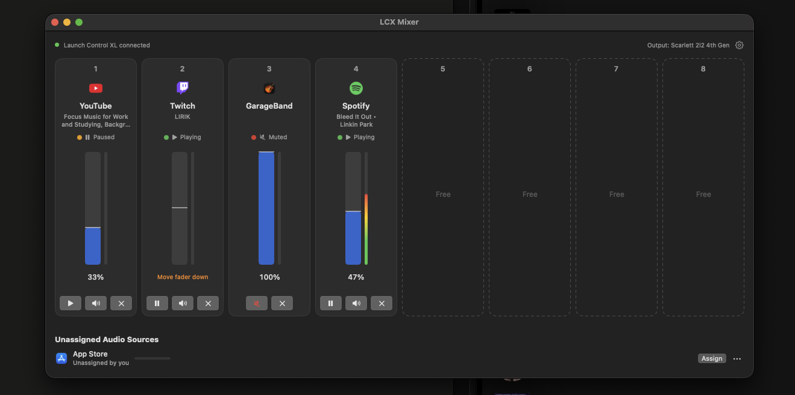
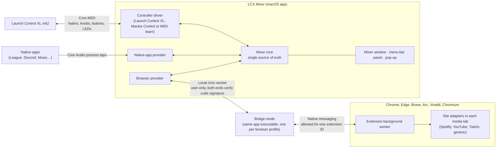

# LCX Mixer — Specification (as built)

This is the product specification LCX Mixer was built from, kept up to date with what is built. For build and install steps, see the [README](../README.md).

**Versions:** v1.0 first release · v1.1 layout restored after a restart, channels moved by drag or right-click · v2.0 code restructured into source providers and controller drivers, other Chromium browsers, mute list, microphone mute, Twitch slider fix, dim green LEDs for native apps, text size, a volume-curve graph, any MIDI controller through MIDI learn, the mixer window opening on launch, Mackie Control (experimental), a welcome window and About with the animated visual · v2.0.1 performance: nothing draws while it can't be seen, lighter background checks · v2.1 event-driven: the app sleeps until something changes, and native apps at 100% play untouched · v2.1.1 crossfaded hand-over when a tap starts or ends · v2.2 foundation, nothing new to see or hear: the mixer core split into parts, one extension file per site, automated tests, unified logging and performance markers, CI and code scanning, a security policy, and a version on saved settings. Also: real level meters for native apps at 100% while the mixer is open, mute-listed sources on one quiet line instead of in Unassigned, and copy and paste in text fields.

## Contents

- [Overview and goals](#overview-and-goals)
- [Architecture](#architecture)
- [Sources, grouping and channel assignment](#sources-grouping-and-channel-assignment)
- [Unassigned sources, the mute list and the ignore list](#unassigned-sources-the-mute-list-and-the-ignore-list)
- [Control mapping](#control-mapping)
- [Knobs](#knobs)
- [Other controllers (MIDI learn)](#other-controllers-midi-learn)
- [Mackie Control (experimental)](#mackie-control-experimental)
- [Mixer window](#mixer-window)
- [Menu-bar icon, panel and on-screen pop-up](#menu-bar-icon-panel-and-on-screen-pop-up)
- [Per-source behaviour](#per-source-behaviour)
- [Status colours](#status-colours)
- [Settings and what is remembered](#settings-and-what-is-remembered)
- [Edge cases and failure handling](#edge-cases-and-failure-handling)
- [Permissions, install and build](#permissions-install-and-build)
- [Testing, logging and auditing](#testing-logging-and-auditing)
- [Performance](#performance)
- [Security](#security)
- [Licence and distribution](#licence-and-distribution)
- [Later ideas](#later-ideas)

## Overview and goals

A small macOS menu-bar app, paired with a browser extension, turns the Launch Control XL mk2 into an 8-channel mixer for everything playing on the Mac. Native apps such as League of Legends or Discord, and individual browser tabs such as Spotify Web, YouTube and Twitch, each land on a fader automatically, first come, first served.

**Goals for v1**

- Every audible source on the Mac can be put on a channel: native apps and individual browser tabs alike.
- Assignment is automatic and stable: a source keeps its channel until it closes or you unassign it.
- The mixer window, the menu-bar panel and the controller LEDs always show the same state.
- No volume jumps from the non-motorised faders.
- Works properly from the first run: clear permission prompts, clear errors, no silent failures.

**Non-goals for v1**

- Safari and Firefox tabs (each browser appears as one whole app). Chromium browsers are supported tab by tab from v2.
- Controllers other than the Launch Control XL mk2. From v2, any MIDI controller works through MIDI learn, and Mackie Control surfaces experimentally.
- Prebuilt or notarised downloads. It's shared as source code that people build themselves.

## Architecture



The Mac app is the hub: it owns the controller, the native-app audio and all state. The browser extension is its hands inside each browser. Inside the app, source providers and controller drivers plug into one small mixer core, so new browsers and controllers don't touch the core.



The controller and native apps connect straight to the Mac app; browser tabs are reached only through the extension.

**Mac app (Swift, SwiftUI)**

1. **Controller driver.** Everything specific to one device. The Launch Control XL driver talks Core MIDI: it turns faders, knobs and buttons into device-independent actions, shows the mixer's requested lights in the colours the hardware has, and reconnects on its own when replugged. The MIDI-learn driver does the same for any other MIDI controller, using the assignments you teach it, without lights. The Mackie Control driver also moves motorised faders and fills scribble strips.
2. **Native-app provider.** Finds which apps are producing sound, traces helper processes back to the app you'd recognise, and applies grouping. For each assigned native source it uses a macOS process tap (macOS 14.2+) to take over that app's audio and play it back at the channel's volume, mute state and master gain. It also measures each source's level for the meters.
3. **Browser provider.** Accepts one bridge connection per browser profile, identifies which browser each comes from, turns the extension's messages into tab reports and carries commands back.
4. **Mixer core.** The single source of truth: channels, the unassigned and mute lists, soft takeover, master mode, the saved layout. It neither parses browser messages nor speaks MIDI. Since v2.2, `MixerCore` coordinates five parts that work on plain values and never call each other, so each can be tested on its own:
    - **ChannelAssignment**: who sits on which channel, who waits, who was unassigned by hand or silenced by the mute list, and the channels held after a restart.
    - **ControlInput**: what a fader, knob or button move means: soft takeover, the speed knob's steps, the seek knob's arming and jump sizes, Twitch's double press. `ButtonHold` tells a short press from a hold.
    - **MuteLists**: which list entries match a source, and which sources a changed list silences or releases.
    - **LightComposer**: what every controller light shows.
    - **TabMerger**: how a browser's tab reports become sources.

    `MixerCore` carries out what they decide: volumes, pop-ups, lights, saving the layout, timers.
5. **UI.** The mixer window, the menu-bar icon and panel, the on-screen pop-up and Settings.
6. **Bridge mode.** The same app executable, which a browser launches in a small bridge mode through native messaging. It relays messages between the extension and the main app over a local socket.

**Browser extension (Manifest V3, any Chromium browser)**

1. **Background worker.** Reports every audible tab to the Mac app (title, site, icon from the browser's local cache, play state, speed, window position), applies tab mute, routes the app's commands to the right tab, and updates itself whenever the app is rebuilt.
2. **Page scripts.** Small scripts in each media tab that set volume, play/pause, speed and seek position. `main-world.js` works with any page's media elements; what's special about a site lives in its own file under `sites/` (YouTube, Spotify, Twitch), which `main-world.js` asks first. Adding or fixing a site touches one file.

**One rule ties them together:** a browser controlled through the extension is never also a native source. Chrome always works tab by tab; another Chromium browser does from the moment its extension first connects. Until then it appears as one whole app, like Safari. So a browser and its tabs never fight over the same sound.

## Sources, grouping and channel assignment

A source is either one native app (or app group) or one browser tab. A new source takes the lowest free channel and keeps it until it closes or you unassign it.

**What counts as a source**

- **Native app:** any app that starts producing sound, other than a browser controlled tab by tab. Sound from hidden helper processes is credited to the app that owns them.
- **App group:** several apps shown and controlled as one source. Built-in group: **League** = Riot Client + League client + League game. Groups are editable in Settings.
- **Browser tab:** each audible tab is its own source, named after the site (Spotify, YouTube, Twitch) with the page title as detail. While tabs from more than one browser are in the mixer, the browser's name is added ("YouTube · Brave").

**Assignment rules**

1. **New source:** the moment it first makes sound, it takes the lowest free channel. If master mode is on, channel 1 is never used for sources.
2. **Held until closed:** pausing, silence, or an idle app never frees a channel. Only quitting the app, closing the tab, or unassigning it does.
3. **Same tab, new site:** a tab that navigates elsewhere keeps its channel; the slot updates its icon and name.
4. **All channels full:** the new source goes to the unassigned list (see next section) and waits.
5. **A channel frees:** the source that has waited longest in the unassigned list takes it. Sources you unassigned yourself don't count as waiting.
6. **No reshuffling:** channels are never reordered or compacted automatically. Drag-and-drop is the only way to move a source to a different channel.
7. **After a restart:** sources that are still open when the app starts again go back to the channels they had, including a paused tab that held one. Each of those channels is held for 10 seconds; a source that hasn't come back by then gives its channel to whatever is waiting. New sources take other free channels in the meantime, and your own Assign and drag can use any free channel.

## Unassigned sources, the mute list and the ignore list

Sources that are playing but not on a channel appear in an **Unassigned Audio Sources** list below the channels, in both the window and the menu-bar panel.

| How a source gets there | Gets a channel again… |
| --- | --- |
| All channels were full when it started | Automatically, when a channel frees (longest-waiting first) |
| You unassigned it (UI button, or hold its mute button for 1 s) | Only when you click **Assign** or drag it onto a channel |

- **Assign** places the source on the first free channel. With no free channel, the button is disabled and says so.
- **Drag a source onto a channel** to place it there. If that channel is occupied, the two swap: the previous occupant moves to Unassigned as "unassigned by you."
- **Unassigning a channel** frees it at once. The audio carries on at its current volume.
- **Manual unassigning lasts until the source closes.** If League is unassigned and then reopened later, it's a new source and takes a channel normally.
- **Mute list (permanent, in Settings):** apps or websites that are always silenced and never take a channel, such as a chat app's notification sounds. While one is being silenced, a single grey line below Unassigned says so ("Muted by your list: WhatsApp"), with **Unmute** to take it off the list; the sound comes back at once and the source takes a channel like a new one. They're not listed among the unassigned sources, since they aren't waiting for a channel. Any source can be added from its "Always mute" menu, in Unassigned or on a channel strip. Native apps are silenced through a process tap (so the purple recording dot shows while they're silenced); tabs through the browser's tab mute.
- **Ignore list (permanent, in Settings):** apps or websites the mixer leaves completely alone: they play as normal, never take a channel and never show in Unassigned, such as system sounds or FaceTime. Any source in Unassigned can be added via its "Always ignore" menu.
- **One list per entry:** an app or website is on the mute list or the ignore list, never both. Adding or moving it to one list, or typing it in, takes it off the other. Moving a source from the mute list to the ignore list gives its sound back first.

## Control mapping

Each of the 8 columns is one channel. The controller stays on **Factory Template 1** (MIDI channel 9); the app selects it automatically. Control numbers and LED values follow Novation's Launch Control XL mk2 programmer's reference.

| Control | Action | Notes |
| --- | --- | --- |
| Fader (per channel) | Volume, 0–100% | Soft takeover; volume curve so the lower half is usable |
| Top button row, Track Focus (per channel) | Play / pause | Browser tabs only; does nothing on native apps (LED dim green). Acts on release. Double-press on Twitch jumps to live. **Hold 3 s = reload the tab** (a hint shows after 1 s) |
| Bottom button row, Track Control (per channel) | Mute / unmute | Works on every source. **Hold 1 s = unassign the channel** |
| Side button **Mute** | Mute / unmute all media playback: what you hear | Restores each channel's own mute state afterwards. LED yellow while on |
| Side button **Solo** | Mute / unmute the microphone: what others hear from you | Mutes the Mac's current input device for every app at once. LED yellow while on |
| Bottom knob row (Pan/Device) | Playback speed | See [Knobs](#knobs) |
| Middle knob row (Send B) | Seek shuttle | See [Knobs](#knobs) |
| Top knob row, Device and Record Arm, arrows | Unassigned | |

**Mute and Solo are split on purpose.** Mute silences everything playing on the Mac; Solo silences the microphone, so a muted mic is never confused with muted media. The pop-up names which was pressed ("All media · Muted", "Microphone · MacBook Pro Microphone · Muted").

**Microphone mute:** uses the input device's own mute where it has one, and otherwise sets its input volume to zero and back. Devices that allow neither, such as Focusrite Scarlett interfaces, show "Can't be muted by apps" in the pop-up. Mute changes made elsewhere, and switching to another microphone, are followed within half a second. Quitting the app unmutes a microphone the app muted, so it is never left silent.

**Master mode (toggle in Settings, off by default)**

- When on, fader 1 controls macOS's output volume and sources use channels 2–8. Channel 1's LEDs stay off and its slot shows a distinct "Master" style.
- Only available when the current output device lets macOS control its volume (MacBook speakers, AirPods, HDMI). With an audio interface that sets its volume in hardware selected, the toggle is greyed out with a one-line reason.
- When the output device changes, master mode adapts on its own. If a source is sitting on channel 1 when master mode turns on, it moves to Unassigned and takes the next free channel.

**Soft takeover:** whenever a fader's position doesn't match its channel's real volume (new source, volume changed elsewhere, master switched), the fader is detached. If the fader is below the real level, the next touch takes over at once, since a jump down is always safe. If it's above, it does nothing until it's moved down to the real level. The UI shows "Move fader down" while it waits.

## Knobs

Knobs rest at centre, which always means "no change". The top row is unused.

| Knob row | Function | Behaviour | LED |
| --- | --- | --- | --- |
| Bottom (Pan/Device) | Playback speed | Steps 0.5× · 0.75× · **1× at centre** · 1.25× · 1.5× · 1.75× · 2×. Takes over once the knob passes the source's current speed. | Green above 1×, red below, off at 1× |
| Middle (Send B) | Seek shuttle | Turned right, it keeps skipping forward; turned left, back. Jumps grow with deflection: 5 / 15 / 30 s every 0.5 s. Centre stops. A knob that isn't centred when a source arrives does nothing until it passes centre. | Green while seeking forward, red while seeking back |

Sources without speed or seeking (live Twitch, Spotify music for speed, native apps) show "Not available" in the pop-up and keep the knob LED off.

## Other controllers (MIDI learn)

Any MIDI controller can drive the mixer. In Settings → Controller, choose **Any MIDI controller (MIDI learn)**, then the device.

- **What can be learned:** each channel's volume, play/pause and mute, plus Mute all media and Microphone mute (26 functions).
- **How:** click **Learn** next to a function, then move the fader or press the button. The assignment shows as its MIDI message, e.g. "CC 7 · ch 1"; the pop-up confirms it.
- **Accepted messages:** control change, note and pitch bend. A volume needs a continuous control, so a note can't be learned as one.
- **Buttons:** a note-on, or a control value of 64 or more, counts as a press. Holding a mute button for 1 s unassigns the channel, as on the Launch Control XL.
- **One control, one function:** learning a control that's already in use moves it to the new function.
- **Clearing:** right-click an assignment to clear it. **Clear all assignments…** sits apart from the table and asks for confirmation in its own row before removing everything.
- **Not covered:** light feedback (every device lights its buttons differently) and the speed and seek knobs.
- Switching controllers releases the previous device at once; assignments are kept for when you switch back.

## Mackie Control (experimental)

Surfaces in Mackie Control (MCU) mode, such as the Behringer X-Touch family, work without setup. Choose **Mackie Control** in Settings → Controller; the device is found by name, or picked from the list.

| Control | Action |
| --- | --- |
| Channel fader 1–8 | Volume. Motorised faders move to each channel's level, so soft takeover isn't needed |
| Select | Play / pause |
| Mute | Mute; hold 1 s to unassign |
| F1 | Mute all media (LED on while muted) |
| F2 | Microphone mute (LED on while muted) |
| V-Pots, master fader, transport | Not used yet |

- **Scribble strips:** the top row shows the source's name, the bottom row its volume or "Muted", in plain ASCII. On the X-Touch, each strip is coloured: green playing, yellow paused, red muted, white a native app.
- **Lights:** Select is lit while playing, Mute while muted (blinking while all media is muted).
- **Motor and hand:** a fader under a finger isn't driven, so the motor never fights the hand; on release it settles on the channel's real level.
- **Status:** written from the protocol without a surface to test on, so it's marked experimental in Settings.

## Mixer window

The window shows the 8 channels side by side as vertical strips, in the same left-to-right order as the controller's columns, so the screen maps 1:1 onto the hardware. The menu-bar panel uses stacked rows instead (next section).

**Each channel strip, top to bottom**

1. **Channel number** (1–8, or "Master" when master mode is on).
2. **Icon:** a small app icon for native apps, or the site's icon for browser tabs. If neither exists, a first-letter tile.
3. **Name and detail:** short name ("Spotify", "League", "Discord") plus one truncated line of detail (page title, or "Client + game").
4. **Status:** glyph (play, pause or mute) plus a coloured dot, as in [Status colours](#status-colours).
5. **Volume:** a vertical bar with the percentage. A ghost marker shows where the physical fader sits. When soft takeover is waiting, a short hint replaces the percentage: "Move fader down".
6. **Level meter:** a real meter for native apps. Below 100% or muted, their sound passes through the app, which measures it. At 100% their sound plays untouched, and while a meter is on screen the app listens to it to measure the level, without changing it (since v2.2; before, they showed activity like browser tabs). For browser tabs, macOS can't separate each tab's sound, so while a tab is audible the bar shows activity instead, made to look unlike a level: neutral drops land at random spots and ripple outward both ways, fading as they spread. With Reduce Motion, each drop glows and fades in place.
7. **Buttons:** play/pause (tabs only), mute, and unassign (×).

**Interactions**

- Clicking the icon or name brings that app, or that exact browser tab, to the front.
- Dragging a strip from anywhere on it (except the volume bar and buttons, which keep their own behaviour) onto another channel moves it there, swapping if occupied. Sources can also be dragged in from the Unassigned list.
- Right-clicking a strip opens a menu: **Move to channel** (each channel listed as "Free" or "swap with …"), **Bring to the front**, **Unassign** and **Always mute**. It's the non-mouse way to move a channel, and works with VoiceOver.
- An empty channel shows a dashed outline with "Free".

**Opening and size**

- Starting the app yourself, including after Quit, opens the mixer window. Starting at login keeps it in the menu bar.
- The window always fits its content: exactly eight strips wide, and as tall as what's inside. It isn't resized by hand; changing the text size resizes it, keeping its top-left corner in place.
- While the app is in the Dock, the menu bar shows the standard LCX Mixer, Edit and Window menus. Their shortcuts work in every LCX Mixer window either way: ⌘C, ⌘V, ⌘X, ⌘A and ⌘Z in text fields, ⌘W to close, ⌘, for Settings and ⌘Q to quit.

**Welcome window and About**

- On the first launch of v2, a welcome window shows the visual and the three setup steps (audio permission, browser extension, controller), each with its live state and a button to fix it.
- **About**, in the menu-bar panel, shows the visual with the version, credits and links, and reopens the setup steps.
- **The visual:** the app's icon and name above a tilted field of square tiles that rise and fall like level meters, green → yellow → red, fading into the bottom edge. Each tower has its own rhythm: a quick rise, a slow fall. Tiles show the icons of apps and websites on the Mac in grey, and generic glyphs elsewhere. Windows have 32 pt corners. With Reduce Motion on it's a still frame.
- A small live copy sits at the bottom of Settings with the credits; clicking it opens About.

**Header and footer**

- **Header:** controller status ("Launch Control XL connected" or a red "Not connected" warning), "All media muted" and "Microphone muted" when on, and the current output device.
- **Below the strips:** the Unassigned list, one row per source with icon, name, activity indicator, Assign (or Unmute for a muted-list source) and a menu with "Always mute" and "Always ignore".
- **Settings** is opened from a gear icon in the window.

## Menu-bar icon, panel and on-screen pop-up

**Menu-bar icon:** one monochrome icon that follows the menu bar's light or dark appearance. It changes in three cases: a small slash when the controller is disconnected, a filled variant while all media is muted, and a crossed-out microphone beside it while the microphone is muted.

**Panel (left or right click):** the same information as the window, as vertically stacked rows, one per channel, without app icons to keep it compact.

- **Each channel row:** channel number · source name with media title ("YouTube – video title") · status dot · status glyph · volume percentage. Empty channels show "Free" in a quiet style.
- **Row actions:** clicking a row's mute or play glyph toggles it; hovering a row reveals unassign (×).
- **Below the rows:** the Unassigned list (name + Assign), then "Open mixer", "Settings" and "Quit".
- **Header line:** controller status, "Media muted" and "Mic muted" when on.

**On-screen pop-up:** touching any control shows a small translucent pill for about 2 seconds, near the top of the screen where that source is playing. It shows the source's icon, the channel number, the source name with its media title, and the new volume or state ("Spotify – song · 45%"). It also appears for 3 seconds when a source gets a channel, waits for one, or is unassigned. It follows light and dark mode and can be turned off in Settings.

## Per-source behaviour

Native apps get volume and mute through the Mac app's audio engine. Browser tabs get volume and play/pause through the site's own player, and mute through the browser's tab mute.

| Source | Volume | Play / pause | Speed and seek | Notes |
| --- | --- | --- | --- | --- |
| Native app (League, Discord, Music…) | Audio engine, only below 100% or muted | Not available | Not available | At 100% it plays untouched. Below, it passes through the app (a few milliseconds of delay); the change-over is a 20 ms crossfade |
| YouTube | YouTube's player (its own slider follows) | Player's play/pause | Both | Ads play in the same player |
| Spotify Web | Moves Spotify's own volume slider; Spotify applies its own loudness curve | Spotify's play/pause button | Seek through Spotify's progress bar; speed not available | |
| Twitch live | Moves Twitch's own volume slider (falls back to the video element if Twitch renames it) | "Pause" silences the tab and keeps the stream live | Not available | Double-press play jumps to live |
| Twitch past broadcasts | Moves Twitch's own volume slider | Player's play/pause | Both | |
| Any other site | The page's audio and video elements | Same elements | Both, when the media has a fixed length | Sites that make sound in other ways get "Mute only" |

**Autoplay limit:** Chromium browsers only let a tab start playback if you've interacted with it before. Resuming something you started yourself always works.

**Play/pause for native apps:** possible through macOS media controls for apps like Music, but left out so far, which focuses on media playing in the browser.

## Status colours

The controller LEDs, the window and the menu-bar panel use the same four colours, so they never disagree. Each colour is always paired with a glyph, so status never depends on colour alone.

| Channel state | Colour | Glyph | Top button LED | Bottom button LED |
| --- | --- | --- | --- | --- |
| Empty | Grey | none | Off | Off |
| Playing | Green | Play | Green | Off |
| Paused (tabs only) | Amber | Pause | Amber | Off |
| Native app, unmuted | Green | Speaker | Dim green | Off |
| Muted | Red | Muted speaker | As before muting | Red |
| Mute only (site without volume control) | as above | as above + "Mute only" label | As above | Dim red when unmuted |
| Tab needs a reload (lost its connection to the extension) | as above | "Reload tab" link | Amber, blinking | As above |
| Master (channel 1, master mode on) | Accent colour | Master icon | Off | Off |

- **All media muted (side Mute):** every occupied channel's bottom LED blinks red, the Mute LED lights, and the menu-bar icon shows its filled variant.
- **Microphone muted (side Solo):** the Solo LED lights and the menu-bar icon gets a crossed-out microphone. The Launch Control XL's side-button LEDs are yellow only, so both show yellow there.
- **Fader detached:** the channel's top LED blinks once when the source arrives; the UI shows the "Move fader" hint.
- **On startup and reconnect,** all LEDs are refreshed from the current state.

## Settings and what is remembered

| Setting | Default |
| --- | --- |
| Use fader 1 as master volume | Off; greyed out when the output device sets its volume in hardware |
| Controller | Novation Launch Control XL mk2; alternatives: Mackie Control (experimental) and any MIDI controller (MIDI learn), with a device picker |
| Volume curve | Natural (gentle at the low end); alternative: linear. A small graph shows how loud each fader position sounds |
| Text size | Default; Smaller, Larger and Largest scale the mixer window, panel, pop-up and Settings. ⌘− / ⌘+ / ⌘0 in the mixer window and Settings |
| Launch at login | On |
| Always show in the Dock | Off: the Dock icon appears only while the mixer window is open |
| Show on-screen pop-up | On |
| Remember volume per app and website | On |
| App groups | League = bundle IDs starting with `com.riotgames.`; add groups with a name and prefixes |
| Mute list | Empty |
| Ignore list | macOS system sounds and notification chimes |
| Browsers | Shows which supported browsers are open and whether each one's extension is connected (per profile) |

**Remembered volume:** the app saves one volume per website (youtube.com) and per app (League), not per tab. It updates whenever you change a source's volume and applies when a new source from that website or app gets a channel. It's stored on this Mac only: a website or app name and a volume, with no tab list, page addresses or history.

**Channel layout:** which source sits on which channel is saved whenever it changes, so it survives a quit or a crash (see assignment rule 7). Only the browser, the tab's number and website, or the app's name, are stored. If the browser was restarted in between, its tabs have new numbers, so they fill channels fresh.

**MIDI learn assignments** are saved per function as the message type, MIDI channel and number.

**Not remembered across restarts, by design:** manual unassigns. A source you unassigned is treated as new after a restart.

**Settings version:** from v2.2 the saved settings carry a version number (1). Settings from 2.1.1 and earlier have none; they're kept exactly as they are and get the number. A release that changes how something is saved raises the number and adds a step that upgrades older settings, instead of guessing. Settings saved by a newer build are left alone.

## Edge cases and failure handling

Nothing fails silently: every problem shows in the window header, the menu-bar panel and, where relevant, on the affected channel.

| Situation | Behaviour |
| --- | --- |
| Controller unplugged, then plugged back in | Window and panel show "Not connected"; the menu-bar icon gets its slash. On reconnect, LEDs are refreshed and all faders start detached |
| Mixer app restarts while media keeps playing | Each source that is still open goes back to its old channel; the fader needs one touch to pick it up again, as the faders aren't motorised |
| Mixer app quits or crashes | Media keeps playing without a jump. Native apps go back to their own volume, so none stays muted; browser tabs keep the volume and mute state they had (verified in testing). A microphone the app muted is unmuted |
| Browser not running, or extension missing | Tabs simply don't appear. If a supported browser runs but no extension connects, the header says so with a fix-it link; Settings → Browsers shows each browser's state |
| Several browsers, or several profiles of one browser | Each connects separately; all their tabs get channels. A tab's ID includes its browser, so equal tab numbers in two browsers never clash |
| Volume changed with a site's or app's own slider | The channel follows the new level and the fader detaches |
| Tab muted from the browser's tab strip | The channel shows muted, and the LED follows |
| Output device switched (audio interface ↔ AirPods) | Native sources keep playing on the new device at the same volumes; master mode availability updates |
| A grouped app opens a new helper process | It joins its group's channel instead of taking a new one |
| A site changes its page and an adapter breaks | That channel falls back to "Mute only", and the channel names the site that needs an adapter fix |
| The extension updates while tabs are open | Each open tab's new page script takes over its players without a reload. The extension re-injects into tabs that never report back (twice), and if an audible tab still finds no player within a minute of the update, its channel shows "Reload tab" and its play LED blinks amber: click it, or hold play for 3 s |
| Audio-capture permission denied | Native apps show in Unassigned as "Permission needed", with a button that opens the right System Settings page. Browser tabs keep working |
| Incognito tabs | Ignored unless you allow the extension in incognito |
| Tab moved to another window or screen | Keeps its channel and all controls: the browser keeps the same tab ID when a tab is dragged between windows |
| Microphone can't be muted by apps (some audio interfaces) | Solo shows "Can't be muted by apps" in the pop-up and nothing changes |
| MIDI-learn device not plugged in | Settings and the window header show it as not connected; it connects on its own when plugged in, with its assignments |

## Permissions, install and build

**Requirements:** macOS 14.2 or later (for process taps), Xcode (free, from the App Store) to build the app, and Chrome or another Chromium browser.

**Permissions, asked once each**

- **System audio recording:** needed so the app can take over native apps' audio. macOS asks the first time a native app takes a channel.
- **No other permissions:** MIDI access, bringing apps to the front, launch at login and muting the microphone need no extra permission. The app never listens to the microphone.

**Install, in this order**

1. Double-click **Build LCX Mixer.command** (or run `scripts/build.sh`). It builds the app, signs it with an "Apple Development" certificate if one exists, installs it to Applications and launches it. With a certificate, the audio permission survives rebuilds.
2. On launch, the app registers its bridge with every supported browser it finds and copies the extension to `~/Library/Application Support/LCXMixer/ChromeExtension`.
3. In each browser: its extensions page (`chrome://extensions`, `edge://extensions`, …) → Developer mode → Load unpacked → that folder. Loaded from there, it updates itself after every rebuild, and the app warns you if a browser uses a different copy.
4. Connect the controller. The app switches it to Factory Template 1 on its own.

**First-run test checklist**

- [x] Spotify Web, a YouTube tab and a Twitch tab each take channels in the order they started
- [x] League client and game appear as one "League" channel
- [x] Faders, play/pause, mute, hold-to-unassign and mute-all work
- [x] Speed and seek knobs, with their LEDs
- [x] Tabs keep their channels when moved to another window or screen; pop-ups appear on the screen where the source plays
- [x] Rebuilds keep the audio permission, and the extension updates itself
- [x] Unplugging and replugging the controller recovers cleanly
- [x] Restarting the app puts sources back on their channels; a closed source's channel frees after 10 seconds
- [x] Dragging a strip onto another channel swaps or moves it; the volume bar and buttons still work normally
- [x] Right-click Move to channel swaps or moves a channel
- [x] Quitting the mixer app leaves all audio playing, with no volume jump
- [x] Audio delay is imperceptible in a real League match

**v2 test checklist**

- [x] Stage 1 (restructure): every v1 behaviour above still works
- [x] Twitch's own slider follows the fader
- [x] A native app's top LED is dim green while it's on a channel
- [x] Always mute silences a source and shows "Muted by list"; Unmute restores it and gives it a channel
- [x] Solo mutes the microphone in Discord, lights its LED and shows the menu-bar badge; an interface that can't be muted says so
- [ ] Tabs in a second browser (Brave, Edge or Arc) get their own channels next to Chrome's: not tested yet
- [x] Text size steps from Settings and ⌘− / ⌘+ / ⌘0; windows fit their content at every size, with no extra space
- [x] The volume-curve graph follows the curve setting
- [x] Switching controllers; MIDI learn assigns, moves and clears controls; Clear all confirms in its row; Launch Control XL lights come back after switching
- [x] The mixer window opens on launch and after Quit, but not at login
- [x] The welcome window, About and the Settings thumbnail show the visual
- [x] The visual shows a still frame with Reduce Motion on
- [ ] The visual reads well in light mode
- [x] After a rebuild, open Spotify and Twitch tabs keep working without a reload
- [x] Holding play for 3 s reloads a tab; a short press still plays and pauses
- [x] Settings sections have clear space between them
- [ ] Tab activity drops: ripple normally, glow in place with Reduce Motion
- [ ] Mackie Control on a real surface (X-Touch): faders, motors, buttons, lights, scribble strips

**v2.2 test checklist** (apart from the three changes at the end, nothing should look, sound or behave differently from 2.1.1)

- [x] All Swift and extension tests pass, for every commit of the split
- [x] The app builds, installs and comes up with the channels where they were
- [ ] Spotify, YouTube, Twitch and a native app: every fader, with soft takeover
- [ ] Channel mute, mute-all and the microphone button
- [ ] Holding mute for 1 s unassigns; holding play for 3 s reloads a tab
- [ ] Play/pause on each tab; a double press on Twitch jumps to live
- [ ] Speed and seek knobs on YouTube
- [ ] Adding a site to the mute list and taking it off again
- [ ] Quitting and reopening puts the channels back
- [ ] The logs show up in `log stream`, and the markers in Instruments
- [ ] Benchmark matches 2.1.1
- [ ] ⌘C, ⌘V, ⌘X, ⌘A and ⌘Z work in Settings' text fields
- [ ] A native app at 100% shows a real meter while the mixer is open; turning it down and back up sounds as smooth as before; the purple dot goes 2 s after closing the mixer (with every app at 100%)
- [ ] A mute-listed source shows on the grey line below Unassigned, not in the list, and Unmute works

## Testing, logging and auditing

**Automated tests** (since v2.2) run with `./scripts/test.sh` or a double-click on **Test LCX Mixer.command**, and on every push in CI.

- **Swift tests** (`swift test`, about 100, in a few seconds): channel assignment and the layout after a restart, fader takeover, the knobs, the fader curve, the mute and ignore lists, tab merging, lights, MIDI parsing, the Launch Control XL and Mackie Control maps, MIDI learn and the settings version. They drive the mixer core with a stand-in controller and a throwaway settings store, so they never touch your real settings, audio or MIDI. Each part of the core also has tests of its own.
- **Extension tests** (`node --test Tests/extension/*.test.mjs`, needs Node.js): the page scripts run in a pretend page with fake versions of each site's controls, including a take-over by a newer extension build, the case that broke in 2.1.

Anything that needs real audio, a controller or a browser stays a manual check: see the test checklists above.

**Logs.** The app logs to macOS's unified log, subsystem `org.lcxmixer.app`, in four categories: audio, midi, browser and ui. Failures are errors; connections and device changes are info, which macOS keeps in memory only. The app writes no log files of its own. To follow it live in Terminal:

```
log stream --level info --predicate 'subsystem == "org.lcxmixer.app"'
```

For the last hour: `log show --last 1h --info --predicate 'subsystem == "org.lcxmixer.app"'`. Anything that could identify you, such as a file path with your user name, shows as `<private>`.

**Performance markers.** The four busiest code paths are marked as named intervals: Native check, Tab merge, LED refresh, and Tap start and Tap stop. In Instruments they appear under Points of Interest with their durations, so a slowdown points straight at one part. They cost next to nothing while nobody records.

**Code checks.** CI builds and tests every push and pull request; CodeQL scans the Swift and JavaScript code. Reporting a security problem, and what the app exposes: [SECURITY.md](../SECURITY.md).

## Performance

A menu-bar utility should cost next to nothing while it sits in the background.

- **Nothing draws unseen.** The tower visual and the tab activity drops run only while their window can be seen: closed, minimised, fully covered or on another Space means no drawing. Closing About or the welcome window releases it entirely.
- **Meters only when shown.** Level meters update only while the mixer window or the menu-bar panel is open.
- **Cheap effects.** Tower glows are soft strokes rather than a per-frame blur; app icons are made grey once per app; the Settings thumbnail runs at 30 fps.
- **Woken by changes, not timers.** Core Audio and macOS notify the app when an app starts or stops sound, quits, or the microphone's mute or the output volume changes. A check every 10 s remains only as a safety net. The meter timer runs only while meters are on screen.
- **Tap only when needed.** A native app at 100% and unmuted plays untouched. With the windows closed, that means no tap at all: no audio work and no purple dot. While the mixer window or panel is open, an app that's playing gets a tap that only listens, for its meter. It's released 2 s after the app goes quiet or the last meter leaves the screen. A tap takes over the volume when it goes below 100% or the app is muted (crossfading from listening, if it was), and goes back to listening, or away, 2 s after the volume is back at 100%.
- **Crossfaded hand-over.** A new tap starts with the app's own sound still playing; once ours flows, the original is muted and ours fades in over 20 ms. Releasing does the reverse. If macOS doesn't allow changing a running tap's mute, it switches straight over with a short fade instead.
- **Audio on the device's own thread.** A tap's audio is processed directly on the output device's real-time thread (already in its audio workgroup), with no extra thread hop, no memory allocation and no locks; level measuring is off while no meter is visible.
- **Quiet extension.** Tab scripts find players as they start instead of scanning every 2 s; the background worker checks in every 5 s.

Measured on an Apple silicon MacBook with Spotify, YouTube and Twitch playing and League on a channel (CPU, 100% = one core):

| State | v2.0 | v2.0.1 | v2.1 | v2.2 |
| --- | --- | --- | --- | --- |
| Menu bar only, windows closed | ~55% · 258 MB | ~2.6% · 44 MB | **~0% · 36 MB** | **~0.4% · 41 MB** |
| Mixer window visible | ~56% · 266 MB | ~13% · 200 MB | ~13% · 194 MB | ~25% · 208 MB |
| Mixer and About visible | ~56% | ~30% · 220 MB | ~30% | not measured |

For v2.2, all four sources were playing and League was turned down to 32%, so every meter on screen was moving. With the window open, it redraws 30 times a second; a profile shows that time going into SwiftUI and macOS drawing the window, with almost none in LCX Mixer's own code, the new listening taps included. The earlier columns weren't necessarily measured with every source active, so the two rows above aren't a like-for-like comparison.

**Measuring it yourself:** `./scripts/benchmark.sh <state> [seconds]` samples the running app with `top` every 2 s (for 5 minutes unless told otherwise) and prints a row with its average and highest CPU and its memory. Set things up first (sources playing, the window you want open), then leave the Mac alone while it runs.

## Security

LCX Mixer has no network attack surface: no server, no web app, nothing listening on the network. Everything stays on the Mac. This was a deliberate design constraint: a live web component would add an attack vector for no benefit to the user.

- **Browser ↔ app:** the browser's native messaging, which it allows only for the one extension ID listed in the app's host manifest.
- **Bridge ↔ app:** a local socket file in a folder only your user account can open (`0700`). The socket file itself is user-only (`0600`).
- **Both ends verify each other:** a connection is accepted only if the other process runs under the same user account and is signed with the app's own code signature. A fake listener or another program can't send or receive mixer commands.
- **MIDI:** the app only reads from the controller you choose and sends light messages only to it (none with MIDI learn). MIDI learn assignments are stored locally.
- **Permissions:** only System audio recording, used to control the volume of apps on a channel. No microphone or accessibility permissions: microphone mute only changes the input device's mute or volume setting. The app makes no network requests at all; site icons come from the browser's local icon cache.
- **Purple menu-bar dot:** while a native app's volume is below 100% or it's muted, or while the mixer window or panel shows native apps' meters, macOS shows its purple system-audio-recording indicator, naming LCX Mixer in Control Center. It is expected and explained in the README; browser tabs never trigger it.
- **Logs** stay in macOS's unified log on the Mac, with anything that could identify you marked private.

How to report a security problem, the full list of what the app exposes, and the three undocumented macOS functions it uses: [SECURITY.md](../SECURITY.md).

## Licence and distribution

Open source under the MIT licence (© 2026 Blaženko Davidović), shared as source code: people build the app and load the browser extension themselves. There's no paid or prebuilt download.

- The README states the motivation, requirements, build steps, security model and known limitations, and that the app was designed and specified by Blaženko Davidović and built with Claude.
- The app ID is neutral (`org.lcxmixer.app`), and the repository contains no personal or machine-specific data. Build logs and build output are excluded.

## Later ideas

- Top knob row: previous/next track, or pinning a channel.
- Play/pause for native media apps through macOS media controls.
- Safari and Firefox tab control through their own extensions.
- Per-channel output routing, such as Discord to headphones and Spotify to the monitors.
- Scenes (saved sets of volumes), ducking, and volume boost above 100%.
